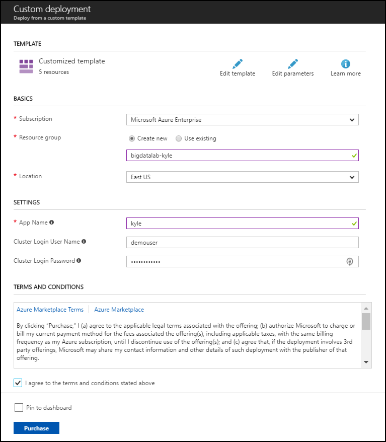
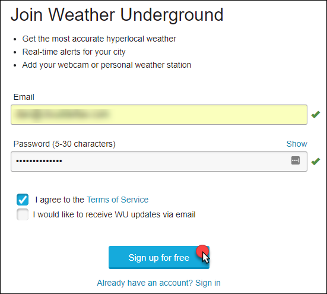
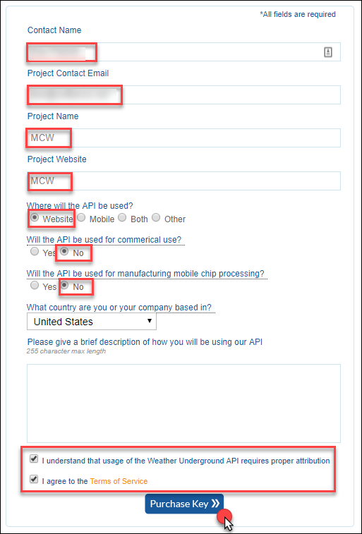
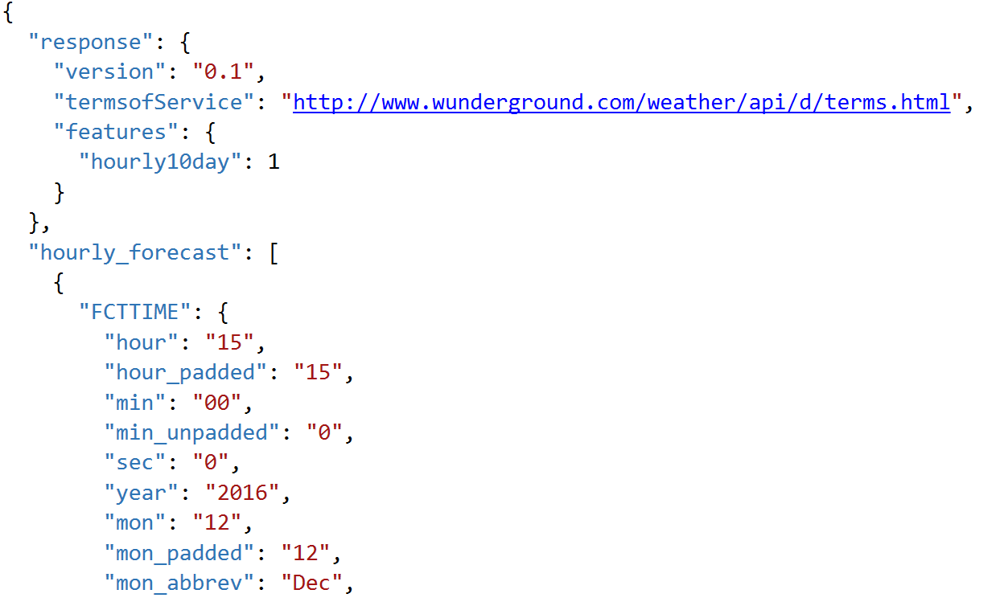
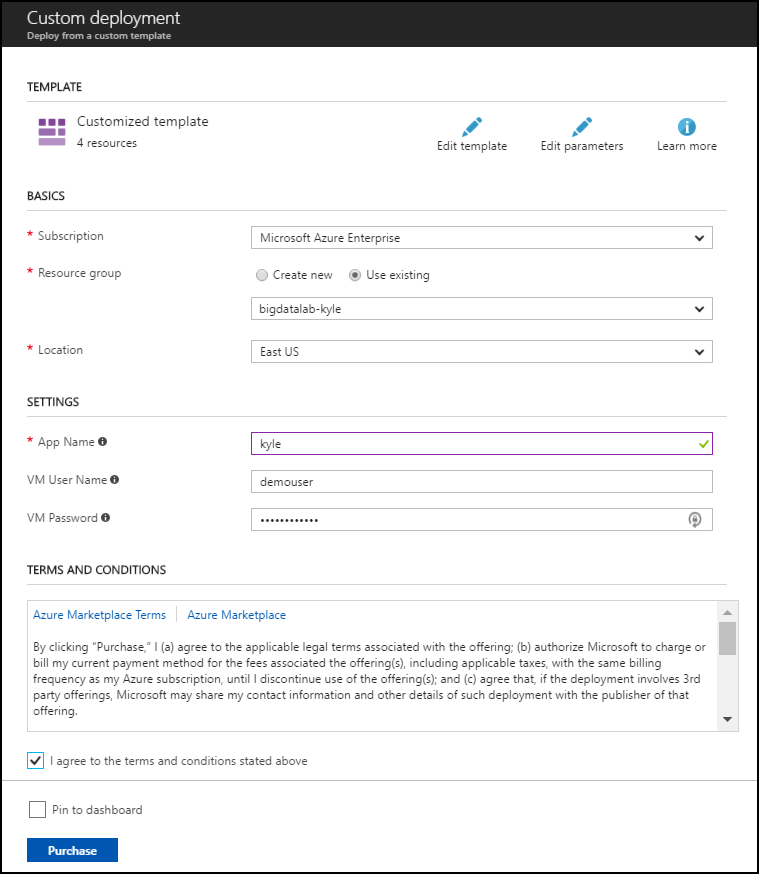
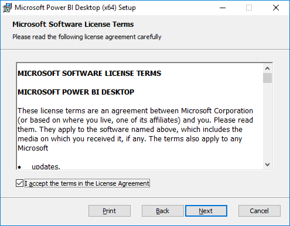
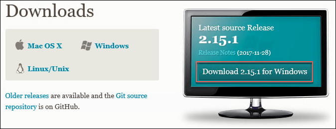
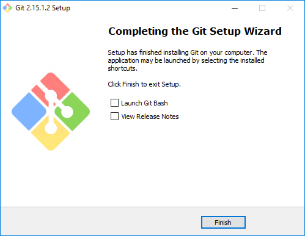

# Big Data and Visualization setup

## Requirements

1.  Microsoft Azure subscription must be pay-as-you-go or MSDN

    a.  Trial subscriptions will not work

## Before the hands-on lab

Duration: 45 minutes

In this exercise, you will set up your environment for use in the rest of the hands-on lab. You should follow all the steps provided in the Before the Hands-on Lab section to prepare your environment *before* attending the hands-on lab.

### Task 1: Deploy HDInsight cluster, Azure ML, and Storage Accounts to Azure

1.  CTRL+Click the **Deploy to Azure** button below, and you will be taken to the Azure portal, and presented with a form for a new custom deployment (which uses an Azure Resource Management (ARM) template from a GitHub repository). You will be presented with a blade to provide some custom parameters as show in the screenshot below.

    

2.  In the Custom deployment blade that appears, enter the following values:

    a.  Subscription: Select your subscription

    b.  Resource group: Use and existing Resource group or create a new one by entering a unique name, such as **"bigdatalab-\[your intials or first name\]".**

    c.  Location: Select a location for the Resource group. Recommend using East US, East US 2, West Central US, or West US 2, as some resources, such as Data Factory, are only available in those regions.

    d.  App name: Enter a unique name, such as your initials or first name. This value must be between 3 and 10 characters long, and should not contain any special characters. Note the name, as you will need to use it in your Lab VM deployment in Task 3 as well.

    e.  Cluster Login User Name: Enter a name, or accept the default. Note all references to this in the lab use the default user name, **demouser,** so if you change it, please note it for future reference throughout the lab.

    f.  Cluster Login Password: Enter a password, or accept the default. Note all references to this in the lab use the default password, **Password.1!!**, so if you change it, please note it for future reference throughout the lab.

    g.  Check the box to agree to the terms.

    h.  Select **Purchase**. 
    
    

3.  The deployment will take about 15 minutes to complete.

4.  Wait for the deployment to complete before attempting to deploy the Lab Virtual Machine in Task 3, as it depends on the Virtual Network created by this deployment. In the meantime, you can move on to the next task, Task 2, while this deployment is ongoing.

### Task 2: Register for a trial API account at WeatherUnderground.com

To retrieve the 10-day hourly weather forecast, you will use an API from WeatherUnderground.com. There is a free developer version that provides you access to the API you need for this hands-on lab.

1.  Navigate to <https://www.wunderground.com/signup>

2.  Complete the Create an Account form by providing your email address and a password, and agreeing to the terms. Select Sign up for free.

    

3.  Navigate to <https://www.wunderground.com/login>.

4.  Once logged into Weather Underground navigate to <http://www.wunderground.com/weather/api/>.

5.  Select **Explore My Options**.

    

6.  On the Get Your API Key page, select **Anvil Plan**.
    
    

7.  Scroll down until you see the area titled How much will you use our service? Ensure **Developer** is selected. 

8.  Select **Purchase Key**.

    

9.  Complete the brief contact form. For Project Name and Project Web use the input **MCW** (Microsoft Cloud Workshop). When answering where will the API be used, select **Website**. For Will the API be used for commercial use and Will the API be used for manufacturing mobile chip processing, select **No**. Select **Purchase Key**.

    

10.  You should be taken to a page that displays your key, like the following. Take note of your API Key. It is available from the text box labeled **Key ID**.

     

11. To verify that your API Key is working, modify the following URL to include your API Key: [http://api.wunderground.com/api/\<YOURAPIKEY\>/hourly10day/q/SEATAC.json](http://api.wunderground.com/api/%3cYOURAPIKEY%3e/hourly10day/q/SEATAC.json)

12. Open your modified link in a browser, you should get a JSON result showing the 10-day, hourly weather forecast for the Seattle-Tacoma International Airport.

### Task 3: Deploy Lab Virtual Machine (Lab VM) to Azure

1.  CTRL+Click the **Deploy to Azure** button below, and you will be taken to the Azure portal, and presented with a form for a new custom deployment (which uses an ARM template from a GitHub repository). You will be presented with a blade to provide some custom parameters as show in the screenshot below. 

2.  In the Custom deployment blade that appears, enter the following values:

    a.  Subscription: Select your subscription

    b.  Resource group: Choose Use Existing, and select the same resource group you used when deploying your HDInsight cluster and Azure ML workspace, above.

    c.  Location: The location should be automatically selected to be the same as your Resource Group.

    d.  App name: IMPORTANT: You must enter the same App name you used in the deployment above in Task

    e.  VM User Name: Enter a name, or accept the default. Note all references to this in the lab use the default user name, demouser, so if you change it, please note it for future reference throughout the lab.

    f.  VM Password: Enter a password, or accept the default. Note all references to this in the lab use the default password, Password.1!!, so if you change it, please not it for future reference throughout the lab.

    g.  Check the box to agree to the terms.

    h.  Select **Purchase**. 
    
    

3.  The deployment will take about 10 minutes to complete.

### Task 4: Install Power BI Desktop on the Lab VM

1.  Connect to the Lab VM. (If you are already, connected to your Lab VM, skip to Step 7.)

2.  From the left side menu in the Azure portal, click on **Resource groups**, then enter your resource group name into the filter box, and select it from the list. 

3.  Next, select your lab virtual machine from the list. 
    
    

4.  On your Lab VM blade, select **Connect** from the top menu. 

    

5.  Download and open the RDP file.

6.  Select Connect, and enter the following credentials (or the non-default credentials if you changed them):

    -   User name: demouser

    -   Password: Password.1!!

7.  In a web browser on the Lab VM navigate to the Power BI Desktop download page <https://powerbi.microsoft.com/en-us/desktop/>

8.  Select the Download Free link in the middle of the page.

    

9.  Run the installer.

10. Select Next on the welcome screen. 

    

11. Accept the license agreement, and select Next. 

    

12. Leave the default destination folder, and select Next. 

    

13. Make sure the Create a desktop shortcut box is checked, and select Install. 

    

14. Uncheck Launch Microsoft Power BI Desktop, and select Finish. 

    

### Task 5: Install an SSH client

In this task, you will download, and install the Git Bash SSH client. This will be used to interact with the HDInsight cluster.

1.  On your Lab VM, open a browser, and navigate to <https://git-scm.com/downloads> to download Git Bash. 

2.  Select the Download 2.xx.x for Windows button.

3.  Run the downloaded installer, selecting Next on each screen to accept the defaults. On the last screen, select Install to complete the installation.

4.  When the install is complete, uncheck View Release Notes, and select Finish.

    

You should follow all these steps provided *before* attending the Hands-on lab.
